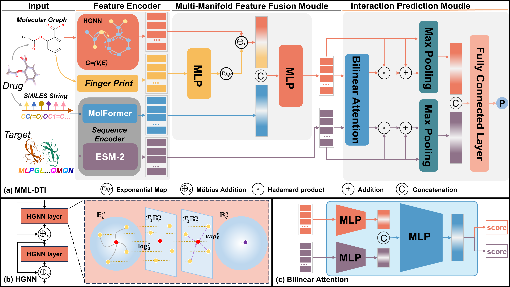

# MML-DTI

MML-DTI：The MML-DTI framework consists of four components: Input, feature decoder, multi-manifold feature fusion module, and interaction prediction module. For drugs, the framework extracts hyperbolic graph neural network features, molecular fingerprints, and pretrained language model features. These representations are then integrated through the multi-manifold feature fusion module to obtain the final drug feature representation. For targets, the final feature representation is directly derived from pretrained language model features. Finally, the drug and target representations are fed into the interaction prediction module to predict potential interactions.

## MML-DTI

## Requirements
Install the required libraries according to the requirements.txt file.
### Premodel
- Download MoLFormer from https://huggingface.co/ibm-research/MoLFormer-XL-both-10pct/tree/main and move it to the preprocess directory.
- Download ESM2-150M from https://huggingface.co/facebook/esm2_t30_150M_UR50D/tree/main and move it to the preprocess directory.

## Data
### Data download
- get from the ./data folder
- get from Link: https://pan.baidu.com/s/1vGt320EY2EnnnIdD6qb4cA?pwd=85ej
  --Extraction code: 85ej
### File location
Place the datasets in the ./MML-DTI/preprocess/raw_data directory.

## Run
-Data Processing: Run txt2csv.py under the /preprocess/raw_data folder to generate the CSV versions of each dataset. Then run /data/split_dataset.py and choose either the random split or the cold-start setting.
-Generate Embeddings: Execute get_embeddings.py in the preprocess folder to obtain protein and drug embeddings for the model. Alternatively, you can run smilesembedding.py and protembeddings.py separately to generate drug and protein embeddings individually.
-Run the Model: Execute main.py.
